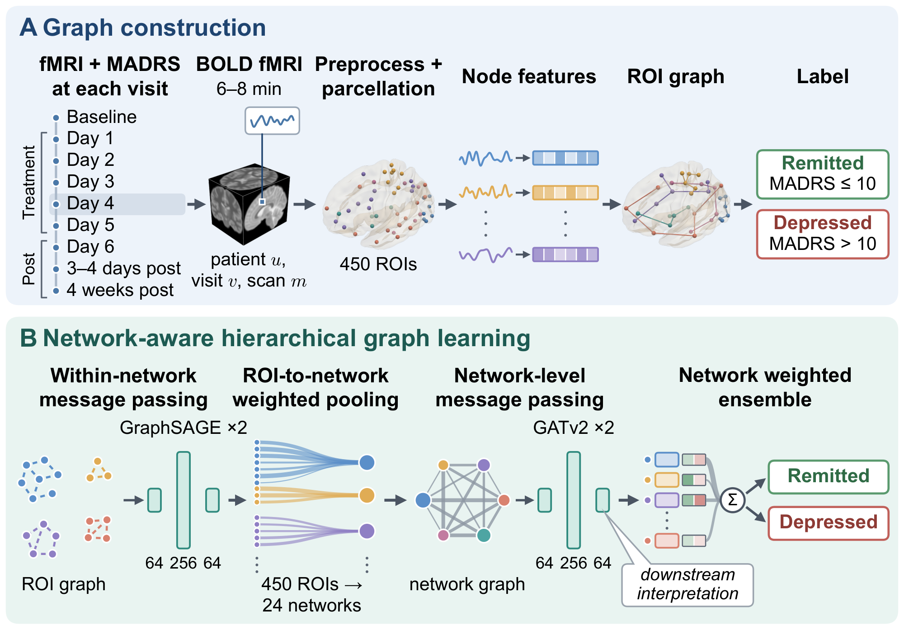

<div align="center">
  <p>
    <a href="docs/methods.md"><strong>Methods</strong></a> |
    <a href="docs/data_schema.md"><strong>Data schema</strong></a> |
    <strong>Paper</strong> (coming soon)
  </p>
</div>

# [MODELNAME]

[MODELNAME] is a hierarchical graph neural network that classifies resting-state fMRI scans as concurrent remission or depression. It passes messages among regions of interest (ROIs) only within their functional network, pools ROIs into network embeddings with learned weights, and models directed communication among networks with graph attention. Gradient-weighted attention on the network edges then shows which network interactions the prediction relies on. The model was developed on longitudinal fMRI from a randomized, sham-controlled trial of Stanford neuromodulation therapy for treatment-resistant depression.

> [!IMPORTANT]
> [MODELNAME] is research code. It classifies the clinical state at the time of each scan and does not predict future treatment response. Attributions describe what the trained model relies on, not biological causality, and the model is not intended for clinical decisions.

# Installation

## Prerequisites

Python ≥ 3.10, PyTorch ≥ 2.0, and PyTorch Geometric ≥ 2.4. You provide parcellated ROI time series and an ROI-to-network assignment (see the [data schema](docs/data_schema.md)); the paper used 450 ROIs (400 Schaefer cortical and 50 Tian subcortical) in 24 functional networks.

## Setup

```bash
git clone https://github.com/tracyhann/tms-gnn.git
cd tms-gnn
pip install -e ".[all]"
```

# Getting Started

Run the end-to-end example on generated data (graph construction, inference, and attribution):

```bash
python examples/synthetic_workflow.py
```

Train and evaluate on your own scans, where `scans` holds `(roi_by_time, label, participant_id)` with label 1 for depression and 0 for remission:

```python
import torch
from torch_geometric.loader import DataLoader

from tms_gnn import GraphConfig, ModelConfig, TrainingConfig
from tms_gnn.graph import build_graph
from tms_gnn.models import HierarchicalBrainGNN
from tms_gnn.training import binary_classification_metrics, participant_level_split
from tms_gnn.training.engine import fit, predict

graph_config = GraphConfig()
graphs = [
    build_graph(roi_by_time, roi_to_network, graph_config, metadata={"y": torch.tensor(float(label))})
    for roi_by_time, label, _ in scans
]
split = participant_level_split([participant for *_, participant in scans], random_state=seed)

def loader(indices, shuffle=False):
    return DataLoader([graphs[i] for i in indices], batch_size=16, shuffle=shuffle)

model = HierarchicalBrainGNN(
    ModelConfig(num_rois=len(roi_to_network), num_networks=int(roi_to_network.max()) + 1)
)
result = fit(model, loader(split.train_indices, shuffle=True), loader(split.validation_indices),
             TrainingConfig())
test = predict(result.model, loader(split.test_indices))
metrics = binary_classification_metrics(test["labels"], test["probabilities"], result.threshold)
```

Splits are made by participant, so all scans and visits of a participant stay in one partition. The defaults reproduce the configuration reported in the paper:

| Component | Default |
|---|---|
| Node features | 32 temporal features under within-ROI and whole-brain normalization (64 per ROI) |
| ROI graph | Directed edges within each functional network, including self-loops |
| ROI encoder | 2 GraphSAGE layers, 64 → 256 → 64, mean aggregation, GELU |
| Pooling | Learned, scan-invariant weights within each network |
| Network encoder | 2 GATv2 layers, 64 → 256 → 64, one head, complete directed network graph |
| Readout | Network-wise linear contributions combined by learned weights into a depression logit |
| Optimization | AdamW, learning rate 0.001, weight decay 0.005, batch size 16, no dropout |
| Stopping | At most 50 epochs, early stopping after 15 epochs without improvement |
| Selection | Checkpoint and decision threshold maximize the validation minimum class recall |
| Split | 29 / 6 / 7 participants (training / validation / test) for a 42-participant cohort |

# Interpretation and Analysis

- `tms_gnn.interpretability`: `gradient_times_attention` (attention × gradient of the class logit), `network_balance` (outgoing minus incoming attribution per network), `dyadic_balance` (A→B minus B→A), and `component_mask` / `apply_perturbation` for removal and retain-only edge perturbations, with `cluster_bootstrap_mean` for participant-cluster bootstrap intervals.
- `tms_gnn.analysis`: participant-clustered logistic regression, treatment moderation, random-intercept mixed models, Benjamini–Hochberg, Holm, and max-statistic FWER, and participant-block permutation.

Equations and definitions are in [docs/methods.md](docs/methods.md).

# Repository Structure

```text
src/tms_gnn/
  graph/              parcellation, temporal node features, ROI graphs
  models/             hierarchical GraphSAGE → pooling → GATv2 model
  training/           participant-level splits, training, thresholds, metrics
  interpretability/   gradient × attention, network balance, perturbation
  analysis/           repeated-measures models and multiplicity control
configs/example.yaml  run-configuration template
docs/                 methods, data schema, figures
examples/             synthetic end-to-end workflow
```

# Paper and Citation

If you find this work useful, please cite:

```bibtex
@article{modelname2026,
  title   = {[MODELNAME]: [MANUSCRIPT TITLE]},
  author  = {[AUTHORS]},
  journal = {[VENUE]},
  year    = {2026}
}
```

# License

Released under the [MIT License](LICENSE).
